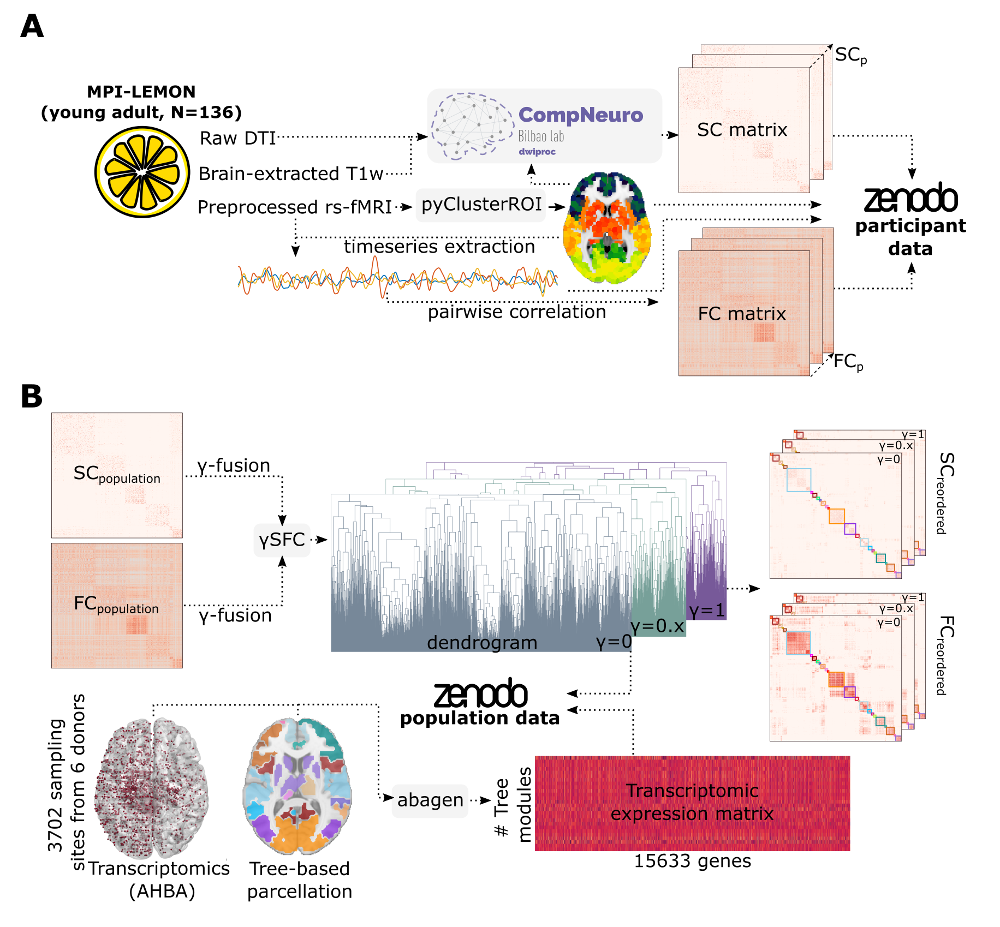

# Brain Hierarchical Atlas 2 (BHA2)

Elucidating the intricate relationship between the structure and function of the brain, both in healthy and pathological conditions, is a key challenge for modern neuroscience. Magnetic Resonance Imaging (MRI) has helped in the understanding of this matter, with diffusion images providing information about structural connectivity (SC)
and resting-state functional MRI revealing the functional connectivity (FC).

Furthermore, the brain operates by discrete multiscale computations in both the time and spatial domains, in a way that is far from known [(Churchland and Sejnowski, The MIT Press, 1994)](https://mitpress.mit.edu/9780262531207/the-computational-brain/). To advance in the understanding of this puzzle, a dual structure-function hierarchical clustering strategy was proposed in [(Diez et. al, SciRep, 2015)](https://www.nature.com/articles/srep10532), providing a common skeleton shared by structure and function. Here, we further extend this approach by:
1. Fine-tuning the amount of matching between SC and FC via a free-parameter $\gamma$. Specifically, when $\gamma$ is set to 0, SC is fully recovered, while when $\gamma$ is set to 1, FC is recovered. In between these extremes, a fusion scenario occurs, where both SC and FC contribute to the connectivity patterns.
2. Making use of brain-transcriptomic data to shed light on biological interpretability of brain-related diseases in the $\gamma$-modulated multiscale structure-function correspondence.
3. Providing to the scientific community open data of different scenarios of structure-function sharing and at different spatial scales, and open code to generate them in a MRI dataset.

An overview of the methodology is shown in the following figure:


## Citation
*Antonio Jimenez-Marin, Ibai Diez, Asier Erramuzpe, Sebastiano Stramaglia, Paolo Bonifazi, Jesus M Cortes*. **Open datasets and code for multi-scale relations on structure, function and neuro-genetics in the human brain**. biorxiv. 2023. https://doi.org/10.1101/2023.08.04.551953

## Prerequisites
### Software
All the code can be executed using a devcontainer. To build the image you need to install first [docker](https://docs.docker.com/engine/install/) and [VScode](https://code.visualstudio.com/download). Then, in *VScode* you can install the extension *Dev-Containers* and open the project in the container.

### Data
The data used in this project is available in [Zenodo](https://zenodo.org/record/8158914). The data is organized in the following way:
```
data
│   ├───iPA_nROIS
│   │   ├───iPA_nROIS.nii.gz
│   │   ├───iPA_nROIS.csv
│   │   ├───SC
│   │   ├───FC
│   │   ├───ts
│   │   |   ├───confounds
│   │   ├───gamma-trees
│   │   ├───transcriptomics.csv
```
Where nROIS have nine possible values: 183, 391, 568, 729, 964, 1242, 1584, 1795 and 2165.

Needless to say, you can use your own data if you have available *dwi* and *resting-state fMRI* sequences. The only requirement is that the data has to be organized in the same way as the data included in the repo. For example if you want to use the Schaefer1000 parcellation, you have to create a folder `data/processed/iPA_n1000/` including the SC and FC matrices.


## Getting started
If you want to use your own data, maybe you want also to build again you own initial parcellations (iPAs). To do so, you first need to preprocess your resting-state fMRI data. For that, you can use our preprocessing pipeline [compneuro-fmriproc](https://github.com/ajimenezmarin/compneuro-fmriproc), also the well know [fMRIPrep](https://fmriprep.org/en/stable/) or your own code. After that, we have included in the repo a code based on [pyClusterROI](https://ccraddock.github.io/cluster_roi/) for creating a ROI based parcellation with a unsupervised voxel-level clustering analysis which delineates a specific number of regions. For using it, first you have to locate the rs-fMRI preprocessed images of the participants included in `participants.tsv` file in the folders `data/processed/rest_prep/sub-XXX`. The name of the individual images has to be `sub-XXX_preprocessed.nii.gz`. After that, you have to run the following command:

```python
python3 utils/create_pyClusterROI_parcel.py <volume_per_roi_desired>
```
The input variable *<volume_per_roi_desired>* means that you will get ROIs with a size near that number. But, as the code is based on trying to reach some constrains, the final size could be different. Also, it is possible to get very small ROIS, so we have included an aditional code to correct both issues. To use it, you need to run the following commands:

```python
python3 utils/correct_small_rois_pyClusterROI.py <volume_per_roi_desired> <min_volume_per_roi>
```
For example if *<volume_per_roi_desired>* = 75 and *<min_volume_per_roi>* = 20, the code forces to have ROIs with a mean volume of 75 voxels and a minimum volume of 20 voxels.

Once you have your iPAs, you will have to build the SC and FC matrices. The FC matrices can be computed using the time-series of your preprocessed resting-state fMRI data as input, and for build the SC matrices you can use our code [compneuro-dwiproc](https://github.com/ajimenezmarin/compneuro-dwiproc)

## Usage
Having the SC and FC matrices ready to use, you can run the code to generate the $\gamma$-modulated multiscale structure-function trees. For that, you need to run the following command:

```python
python3 src/build_tree.py <project_path> <conn_size> <tree_lower> <tree_upper> <tree_class>
```
Where:
* *<project_path>* is the path to the project folder.
* *<conn_size>* is the number of ROIs of the iPA selected.
* *<tree_lower>* is the lower bound of the tree.
* *<tree_upper>* is the upper bound of the tree.
* *<tree_class>* has two options:
    - `full` define levels with all the modules included, e.g. level 3 will have 3 modules and level 4 will have 4 modules
    - `reduced` define levels with unique modules, i.e. level 4 will have two modules equal to the level 3 so them will not be included.

By default, all the sc/fc connectomes included in the data folder will be loaded. If you want to use only a subset of participants paired by sex, you have to change the function `load_data` to `load_data_sex_paired` in the `build_tree.py` file and in the notebooks `01-calc_optimal_parcellation_figS1.ipynb`, `02-g_modulated_graph_node_strength_fig2.ipynb`, `03-hierarchical_parcellation_metrics_figS2_figS3.ipynb`.

## Outputs
The outputs of the code are the $\gamma$-modulated multiscale structure-function trees as well as an iPA wich include only the ROIs that are connected in both connectomes, and they are stored in `bha2/data/iPA_nROIS/processed/`. The trees are saved in a *json* file including a dictionary with the ROIs grouped in each pair module-level. For example:

```
lvl_20_mod_5: [0, 1, 2, 3, 4, 5, 6, 7, 8, 9]
```

## Optimal parcellation description
With the generated trees you can follow a multi-scale strategy to generate brain connectivity features at different scales, and an optimal strategy selecting the best parcellation which maximizes the correspondence between SC and FC. In this repo, we have included different python-based notebooks showing different situations describing the modules from different perspectives, from the anatomical and functional interpretation, to their neurobiological relevance in different brain related disorders. Additionally, in each of the notebooks we also generate the figures included in the paper.
